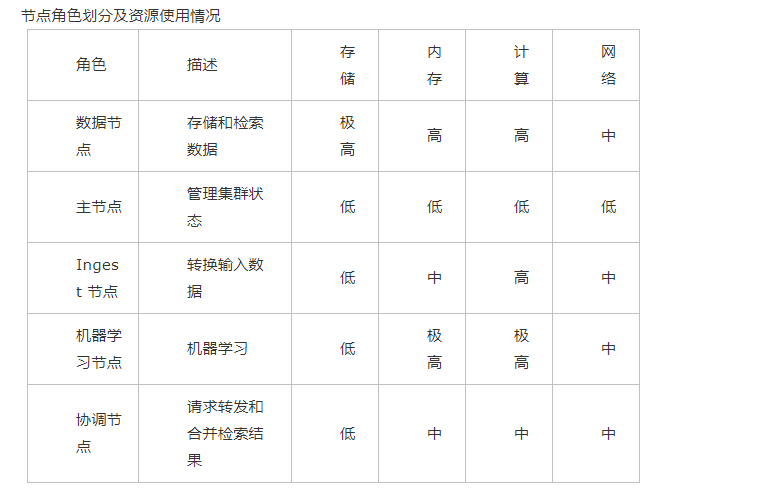

# elasticsearch手册

## elasticsearch 基本概念
参考地址：https://www.cnblogs.com/Onlywjy/p/12194626.html  
- 文档（Document）  
 Elasticsearch是面向文档的，文档是所有可搜索数据的最小单位
 文档会被序列化成JSON格式，保持在Elasticsearch中  
 每一个文档都有一个UniqueID  
 文档的元数据  
 元数据，用于标注稳定的相关信息  
 _index -文档所属的索引名  
 _type -文档所属的类型名                                         
 _source-文档的原始Json数据  
 _version-文档的版本信息  
 _score-相关性打分  
- 索引（ Index- 索引是文档的容器，是一类文档的结合）  
 Index体现了逻辑空间的概念：每一个索引都有自己的Mapping定义，用于定义包含的文档的字段名和字段类型  
 Shard体现了物理空间的概念：索引中的数据分散在Shard上  
  索引的Mapping与Settings    
        Mapping定义文档字段的类型  
        Setting定义不同的数据分布  
- Type  
 在7.0之前，一个index可以设置多个Types  
 6.0开始，Type已经被Deprecated。7.0开始一个索引只能创建一个Type -"_doc"  


- 分布式系统的可用性与扩展性
- 高可用  
    服务可用性-允许有节点停止服务  
数据可用性-部分节点丢失，不会丢失数据  
- 可扩展性  
存储的水平扩容 请求量提升/数据的不断增长（将数据分布到所用节点上）  
- 集群
多台Es服务器的结合的统称叫ES集群  
- 集群的健康状态  
Green-主分片与副本都正常分配  
Yellow-主分片全部正常分配，有副本分片未能正常分配  
Red-有主分片未能分配（例如 当服务器的磁盘容量超过85%时，去创建了一个新的索引）
- 节点  
节点是一个Elasticsearch的实例，本质上就是一个JAVA进程  
每一个节点都有名字，通过配置文件配置，或者启动时候指定  
每一个节点在启动之后，会分配一个UID，保存在data目录下  
Master-eligible nodes 和Master Node（主节点）  
 每个节点启动后，默认就是一个Master eligible节点（可以设置node.master:false禁止）  
Master-eligible节点可以参加选主流出，成为Master节点  
 每个节点上都保存了集群的状态，只有Master节点才能修改集群的状态信息  
 集群状态（cluster state）维护了一个集群中必要的信息所有节点的信息/所有的索引和其相关的Mapping与Setting信息/分片的路由信息
   任意节点都能修改信息会导致数据的不一致性   
- DataNode(数据节点)    
可以保存数据的节点。负责保存分片数据。在数据扩展上起到了至关重要的作用  
- Coordination Node（协调节点）  
负责接收Client的请求，将请求分发到合适的节点，最终把结果汇集到一起
每个节点默认都起到了Coordination Node的职责   
- Hot&Warm Node
不同硬件配置的Data Node，用来实现Hot&Warm架构，降低集群部署的成本  
- Machine Learning Node 
负责跑机器学习的Job,用来做异常检测  
- Ingest Node  
Ingest Node 可以看作是数据前置处理转换的节点，支持 pipeline管道 设置，可以使用 ingest 对数据进行过滤、转换等操作，类似于 logstash 中 filter 的作用。
- Tribe Node
5.3开始使用Cross Cluster Search）TribeNode 连接到不同的Elasticsearch集群，并且支持将这些集群当成一个单独的集群处理  
- 节点类型及资源使用情况
    

- 分片（Primary Shard & Replica Shard）
将数据切分放在每个分片中，分片又被放到集群中的节点上。
每个分片都是独立的lucene实例    
分片数设置过小    
导致后续无法增加节点实现水平扩展
单个分片的数据量太大，导致数据重新分配耗时  
分片数设置过大  
影响搜索结构的相关性打分，影响统计结果的准确性
单个节点上过多的分片，会导致资源浪费，同时也会影响性能  
分片为主分片和备份分片     
副本分片数提高了数据冗余量
主分片挂掉以后能够自动由副本分片升为主分片
备份分片还能够降低主分片的查询压力(会消耗更多的系统性能)   

## 安装
### 组件介绍   
kibana elastic 可视化    
分词插件：  
ik   
https://github.com/medcl/elasticsearch-analysis-ik  
pingyin   
https://github.com/medcl/elasticsearch-analysis-pinyin  

ElasticHD 可视化（360开源）  
https://github.com/360EntSecGroup-Skylar/ElasticHD

filebeat   
轻量级日志收集

logstash    
elasticsearch 日志收集  
### install

- 下载地址（https://www.elastic.co/cn/downloads/）
```shell script
install jdk 11 
groupadd es
useradd es -g es -p es 
chown -R es:es  elasticsearch-7.8.0

su es
cd  elasticsearch-7.8.0/bin
./elasticsearch -d 

hostnamectl  set-hostname node1
vim /etc/hosts
192.168.30.210 node1

#修改 config/elasticsearch.yml
vim /etc/
node.name: node1
network.host: 192.168.30.210
discovery.seed_hosts: ["node1"]


# 启动 kibana
vim config/kibana.yml
elasticsearch.hosts: ["http://node1`:9200"]

./kibana 


# logstash 

tar -xvf xx.tar

tcp 样例配置(logstash-tcp)

input {
  tcp {
    mode => "server"
    host => "node1"
    port => 9250
  }
}

output {
  elasticsearch {
    hosts => ["http://node1:9200"]
    index => "app_log-%{+YYYY.MM}"
    #user => "elastic"
    #password => "changeme"
  }
}

./logstash -f ../config/logstash-tcp.conf


# filebeat

参见项目 elasticsearch-logback-filebeat-demo/filebat


./filebeat -c filebeat.yml
```

## 开发使用

参考地址:https://www.jianshu.com/p/1fbfde2aefa5

### restapi

```http request
# 分词
GET _analyze?pretty=true
{
  "text": "中华五千年",
  "analyzer": "ik_smart"
}
{
  "text": "nihao",
  "analyzer": "pinyin"
}

# 创建索引
number_of_shards	分片数
number_of_replicas	副本数
mappings	结构化数据设置 下面的一级属性 是自定义的类型
properties	类型的属性设置节点，下面都是属性
epoch_millis	表示时间戳

PUT index_name?pretty=true
{
    "settings" : {
        "index" : {
            "number_of_shards" : 3, 
            "number_of_replicas" : 2 
        }
    },  
    "mappings" : {
            "dynamic": false,
            "properties" : {
                            "contract_id":{
                                "type" : "long",
                                "index":true
                            },  
                            "contract_name":{
                                "type":"text",
                                "index":true
                            },  
                            "contract_code":{
                                "type":"keyword",
                                "index":true
                            },  
                             "contract_hash":{
                                "type":"keyword"
                            },
                             "plat_id":{
                               "type" : "long",
                               "index":true
                            },
                             "contract_figure":{
                               "type" : "keyword",
                               "index":true
                            },
                            "serial_number":{
                               "type" : "keyword",
                               "index":true
                            },
                            "create_time":{
                                "type": "date",
                                "index":true
                            }
                        }
    }
}
#查看所有索引
GET _cat/indices
# 查看多个索引
GET twitter?pretty=true
# 删除索引
DELETE index_name
# 添加数据
PUT index_name/_doc/1?pretty=true
{
    "contract_id" : 1,
    "contract_name" : "测试合同0001",
    "contract_code" : "test-code-01",
    "contract_hash" : "MD5ssssssssssssss",
    "plat_id" : 1001,
    "contract_figure" : "sha256111111111111111111",
    "serial_number" : "test-123456",
    "create_time" : "2020-07-16T15:01:25Z"
}
# 查看数据
单条
GET contract/_doc/1?pretty=true
# 搜索
GET contract/_search?pretty=true
# 条件查询
GET contract/_search?pretty=true
{
    "query" : {
        "match" : { 
            "contract_name" : "合同"
        }
    }
}

# 模糊查询
GET app_log-2020.07/_search?pretty=true
{
    "query": {
        "match" : {
            "message" : {
                "query" : "删除",
                "fuzziness": "AUTO"
            }
        }
    }
}


# 多字段搜索
GET contract/_search?pretty=true
{
   "query" : {
           "multi_match" : { 
               "query":"合同",
               "fields" : ["xxx","xxx"]
           }
       }
}


```
### sql 语法支持

```http request

POST _sql/translate?format=txt
{
  "query":"select * from log where time between 100 and 1001",
   "fetch_size": 10
}
转换:
{
  "size" : 1000,
  "query" : {
    "range" : {
      "dtTime" : {
        "from" : 100,
        "to" : 1001,
        "include_lower" : true,
        "include_upper" : true,
        "time_zone" : "Z",
        "boost" : 1.0
      }
    }
  },
  "_source" : {
    "includes" : [
      "appName",
      "className",
      "content",
      "dtTime",
      "logLevel",
      "method",
      "serverName"
    ],
    "excludes" : [ ]
  },
  "sort" : [
    {
      "_doc" : {
        "order" : "asc"
      }
    }
  ]
}

```


### 日志搜索查询

```http request

#查看日志索引内容

GET file_beat_demo-2020.07
# 搜素日志并按照时间排序

GET file_beat_demo-2020.07/_search?pretty=true
{
  "query": {
        "match" : {
            "message" : {
                "query" : "测试 删除",
                "operator" : "and",
                "zero_terms_query": "all"
            }

        }
    },
    "sort": [
    {
      "@timestamp": {
        "order": "desc"
      }
    }
  ]
}
# 模糊搜索
GET app_log_2-2020.07/_search?pretty=true
{
    "query": {
        "match" : {
            "message" : {
                "query" : "测试",
                "fuzziness": "AUTO"
            }
        }
    }
}

```


### java RestHighLevelClient

```java
 @Autowired
    RestHighLevelClient restHighLevelClient;
    String indexName = "contract";
    String mapping = " \"dynamic\": false,\n" +
            "            \"properties\" : {\n" +
            "                            \"contract_id\":{\n" +
            "                                \"type\" : \"long\",\n" +
            "                                \"index\":true\n" +
            "                            },  \n" +
            "                            \"contract_name\":{\n" +
            "                                \"type\":\"text\",\n" +
            "                                \"index\":true\n" +
            "                            },  \n" +
            "                            \"contract_code\":{\n" +
            "                                \"type\":\"keyword\",\n" +
            "                                \"index\":true\n" +
            "                            },  \n" +
            "                             \"contract_hash\":{\n" +
            "                                \"type\":\"keyword\"\n" +
            "                            },\n" +
            "                             \"plat_id\":{\n" +
            "                               \"type\" : \"long\",\n" +
            "                               \"index\":true\n" +
            "                            },\n" +
            "                             \"contract_figure\":{\n" +
            "                               \"type\" : \"keyword\",\n" +
            "                               \"index\":true\n" +
            "                            },\n" +
            "                            \"serial_number\":{\n" +
            "                               \"type\" : \"keyword\",\n" +
            "                               \"index\":true\n" +
            "                            },\n" +
            "                            \"create_time\":{\n" +
            "                                \"type\": \"date\",\n" +
            "                                \"index\":true\n" +
            "                            }\n" +
            "                        }";


    @Test
    public void testRestHighLevelClient() throws Exception {
        if (!existIndex(indexName)) {
            createIndex(indexName, mapping);
        }
        //保存
        ContractDTO contractDTO = new ContractDTO();
        contractDTO.setContract_id(2L);
        contractDTO.setContract_code("testcode");
        contractDTO.setContract_figure("figuretest");
        contractDTO.setContract_hash("md51111");
        contractDTO.setContract_name("测试合同002");
        contractDTO.setCreate_time(new Date());
        contractDTO.setSerial_number("2123456");
        contractDTO.setPlat_id(125L);
        EsDTO insertDTO = new EsDTO();
        insertDTO.setId(String.valueOf(contractDTO.getContract_id()));
        insertDTO.setJsonData(JSON.toJSONString(contractDTO));
        saveOrUpdate(indexName, insertDTO);
        MatchQueryBuilder matchQuery = QueryBuilders.matchQuery("contract_name", "测试合同");
        SearchSourceBuilder searchSourceBuilder = searchSourceBuilder(matchQuery);
        SortBuilders.fieldSort("create_time").order(SortOrder.DESC);
        List<ContractDTO> search = search(indexName, searchSourceBuilder, ContractDTO.class);
        System.out.println(JSON.toJSONString(search));

    }

    public boolean existIndex(String indexName) throws IOException {
        return restHighLevelClient.indices().exists(new GetIndexRequest(indexName), RequestOptions.DEFAULT);
    }

    public void deleteIndex(String indexName) throws IOException {
        restHighLevelClient.indices().delete(new DeleteIndexRequest(indexName), RequestOptions.DEFAULT);
    }

    public void createIndex(String indexName, String indexMapping) throws IOException {
        if (!this.existIndex(indexName)) {
            log.error("indexName {} 已存在", indexName);
            return;
        }
        CreateIndexRequest request = new CreateIndexRequest(indexName);
        defaultIndexSetting(request);
        request.mapping(indexMapping, XContentType.JSON);
        CreateIndexResponse res = restHighLevelClient.indices().create(request, RequestOptions.DEFAULT);
        if (!res.isAcknowledged()) {
            log.error("创建索引失败");
            throw new RuntimeException("创建索引失败");
        }
    }

    public void saveOrUpdate(String indexName, EsDTO esDTO) throws IOException {
        IndexRequest request = new IndexRequest(indexName);
        request.id(esDTO.getId());
        request.source(esDTO.getJsonData(), XContentType.JSON);
        IndexResponse indexResponse = restHighLevelClient.index(request, RequestOptions.DEFAULT);
        if (indexResponse.status().equals(RestStatus.OK)) {
            log.debug("新增成功");
        }

    }

    public void insertBatch(String indexName, List<EsDTO> list) {
        BulkRequest request = new BulkRequest();
        list.forEach(item -> request.add(new IndexRequest(indexName).id(item.getId())
                .source(item.getJsonData(), XContentType.JSON)));
        try {
            restHighLevelClient.bulk(request, RequestOptions.DEFAULT);
        } catch (Exception e) {
            throw new RuntimeException(e);
        }
    }

    public <T> void deleteBatch(String indexName, Collection<T> idList) {
        BulkRequest request = new BulkRequest();
        idList.forEach(item -> request.add(new DeleteRequest(indexName, item.toString())));
        try {
            restHighLevelClient.bulk(request, RequestOptions.DEFAULT);
        } catch (Exception e) {
            throw new RuntimeException(e);
        }
    }

    public <T> List<T> search(String indexName, SearchSourceBuilder builder, Class<T> resultClass) throws IOException {
        SearchRequest request = new SearchRequest(indexName);
        request.source(builder);
        SearchResponse response = restHighLevelClient.search(request, RequestOptions.DEFAULT);
        SearchHit[] hits = response.getHits().getHits();
        if (hits != null && hits.length > 0) {
            return Arrays.stream(hits).map(hit -> {
                return JSON.parseObject(hit.getSourceAsString(), resultClass);
            }).collect(Collectors.toList());
        }
        return null;


    }

    public void defaultIndexSetting(CreateIndexRequest request) {
        /*request.settings(Settings.builder().put("index.number_of_shards", 3)
                .put("index.number_of_replicas", 2));*/
    }

    public static SearchSourceBuilder searchSourceBuilder(QueryBuilder queryBuilder, int from, int size, int timeout) {
        SearchSourceBuilder sourceBuilder = new SearchSourceBuilder();
        sourceBuilder.query(queryBuilder);
        sourceBuilder.from(from);
        sourceBuilder.size(size);
        sourceBuilder.timeout(new TimeValue(timeout, TimeUnit.SECONDS));
        return sourceBuilder;
    }

    public static SearchSourceBuilder searchSourceBuilder(QueryBuilder queryBuilder) {
        return searchSourceBuilder(queryBuilder, 0, 10, 60);
    }

```

### 相关文档地址


官方文档导航:https://www.elastic.co/guide/index.html

java client 官网地址:https://www.elastic.co/guide/en/elasticsearch/client/java-rest/current/java-rest-high-getting-started.html

logstash 文档地址: https://www.elastic.co/guide/en/logstash/current/getting-started-with-logstash.html

filebeat 文档地址:https://www.elastic.co/guide/en/beats/filebeat/current/index.html

spring-data-elasticsearch 仓库地址:https://github.com/spring-projects/spring-data-elasticsearch

logstash-logback :https://github.com/logstash/logstash-logback-encoder

elasticsearch-sql支持(elasticsearch-sql):https://www.elastic.co/cn/what-is/elasticsearch-sql

Elasticsearch-SQL:https://github.com/NLPchina/elasticsearch-sql(已宣布不维护)

轻量级日志搜索:  https://gitee.com/frankchenlong/plumelog
中文指南:https://legacy.gitbook.com/book/chenryn/elk-stack-guide-cn/details
filebeat 配置:https://www.elastic.co/guide/en/beats/filebeat/current/index.html
参考博客:https://www.jianshu.com/p/c801ec3a64e5