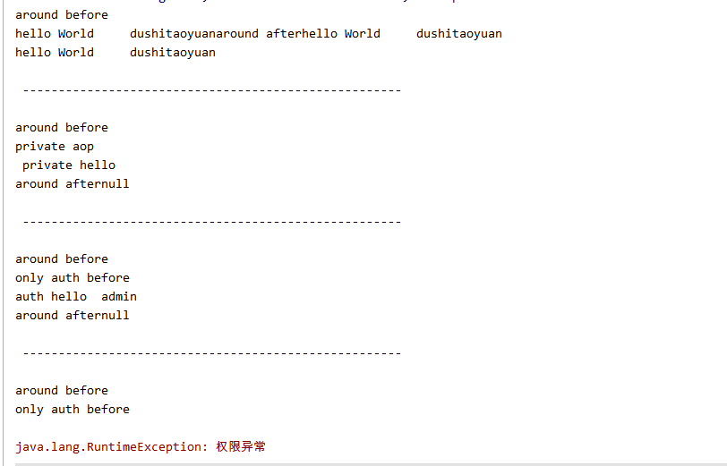
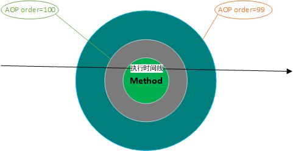
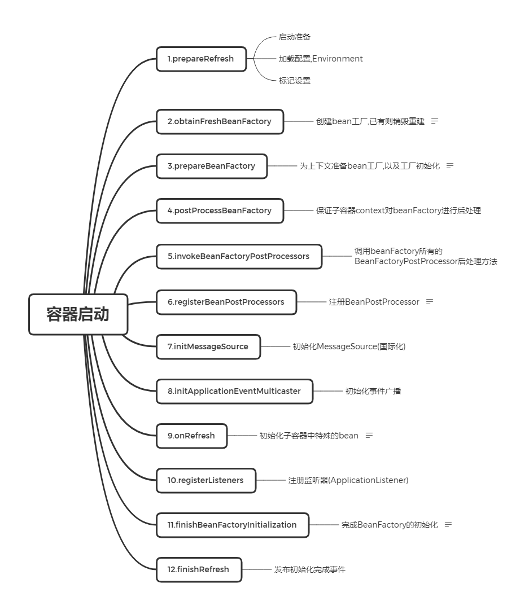

# spring核心原理

## aop(面向切面编程)

### aop实现
**原理简析:**
编译时期,java编译器会调用实现了(JSR 269 Pluggable Annotation Processing API)标准的插件,lombok和aspectj 就是通过编译时期(javac) 解析成抽象语法树之后(AST),  根据程序的注解处理器，可实现动态修改语法树,动态的修改 AST，最终生成字节码(.class)
#### aspectj 

##### CTW 编译时织入

* aspectj(CTW 编译时织入) 编程准备
1. 环境
    * idea
    * aspectj 依赖包下载(非必须)
    [下载地址](https://www.eclipse.org/aspectj/downloads.php) （java -jar 安装）
     也可以不下,借助idea 和maven也可实现
    * 工程依赖环境准备
    ```xml
    
      <dependencies>
        <dependency>
          <groupId>junit</groupId>
          <artifactId>junit</artifactId>
          <version>4.11</version>
          <scope>test</scope>
        </dependency>
    
       <!--切入点表达式支持-->
            <dependency>
                <groupId>org.aspectj</groupId>
                <artifactId>aspectjweaver</artifactId>
                   <version>1.8.1</version>
            </dependency>
         <!-- aop 注解支持-->
                <dependency>
                <groupId>org.aspectj</groupId>
                <artifactId>aspectjrt</artifactId>
                <version>1.8.1</version>
             </dependency>
    
      <build>
    <plugins>
          <plugin>
                    <groupId>org.codehaus.mojo</groupId>
                    <artifactId>aspectj-maven-plugin</artifactId>
                    <version>1.10</version>
                    <configuration>
                        <complianceLevel>1.8</complianceLevel>
                        <source>1.8</source>
                    </configuration>
                    <executions>
                        <execution>
                            <goals>
                                <goal>compile</goal>
                                <goal>test-compile</goal>
                            </goals>
                        </execution>
                    </executions>
                </plugin>
    </plugins>
      </build>
    ```
    
    2. aspectj 原生编程小例子
    
    * 示例java类
    
      ```java
      package com.ncs.springbase.core.aop;
      
      import com.ncs.springbase.core.aop.anno.Auth;
      
      /**
       * @author dushitaoyuan
       * @desc aop 测试类
       * @date 2019/12/27
       */
      public class HelloWorldService {
          public String hello(String name) {
              String prefix="hello World \t";
              String result=prefix+name;
              System.out.printf(result);
              return result;
          }
          private void privateHello() {
              System.out.println(" private hello");
          }
      
      
          @Auth(needRole = "admin")
          public void helloAuth(String role) {
              System.out.println("auth hello \t"+role);
          }
      
          public static void main(String[] args) {
              HelloWorldService helloWorldService=new HelloWorldService();
              helloWorldService.privateHello();
          }
      }
      
      ```
    
      * 测试类
    
        ```java
        package com.ncs.springbase.core.aop;
        
        import org.junit.Test;
        
        /**
         * @author dushitaoyuan
         * @desc aop 测试类
         * @date 2019/12/27
         */
        
        public class HelloWorldServiceTest {
            @Test
            public void helloTest() {
                String name="dushitaoyuan";
                HelloWorldService helloWorldService=new HelloWorldService();
                System.out.println(helloWorldService.hello(name));
                String spilt="\n -----------------------------------------------------\n";
                System.out.println(spilt);
                HelloWorldService.main(null);
                System.out.println(spilt);
                helloWorldService.helloAuth("admin");
                System.out.println(spilt);
                helloWorldService.helloAuth("public");
        
            }
        }
        
        ```
    
        * 编写aspectj 切点声明
    
          ```java
          package com.ncs.springbase.core.aop;
          
          import com.ncs.springbase.core.aop.anno.Auth;
          import org.aspectj.lang.reflect.MethodSignature;
          
          import java.util.Objects;
          
          /**
           * @author dushitaoyuan
           * @desc HelloWorldServiceAspect
           * @date 2019/12/27
           *
           */
          public aspect HelloWorldServiceAspect {
              /**
               * 所有public 方法切点
               */
              public pointcut allPublicMethodPoint(): execution(public * com.ncs.springbase.core.aop.HelloWorldService+.*(..));
              /**
               * 所有私有 方法切点
               */
              public pointcut allPrivateMethodPoint(): execution(private * com.ncs.springbase.core.aop.HelloWorldService+.*(..));
              /**
               * 注解 方法切点
               */
              public pointcut allAuthMethodPoint(): execution(public * com.ncs.springbase.core.aop.HelloWorldService+.*(..))&& @annotation(Auth);
          
              Object around(): allPublicMethodPoint(){
                  MethodSignature methodSignature = (MethodSignature) thisJoinPoint.getSignature();
                  System.out.println("around before");
                  Object result = proceed();
                  System.out.println("around after" + result);
                  return result;
              }
              Object around(): allPrivateMethodPoint(){
                  System.out.println("private aop");
                  return proceed();
              }
              before(): allAuthMethodPoint(){
                  System.out.println("only auth before");
                   MethodSignature methodSignature = (MethodSignature) thisJoinPoint.getSignature();
                   Auth auth = methodSignature.getMethod().getAnnotation(Auth.class);
                   if(AopUtil.isUnAuth(auth)){
                       return;
                   }
                   Object currentRole=AopUtil.findValue(thisJoinPoint.getArgs(),methodSignature.getParameterNames(),"role");
                   if(Objects.nonNull(currentRole) && !currentRole.toString().equals("admin")){
                       throw  new RuntimeException("权限异常");
                   }
              }
          
          
          
          }
          ```
    
          完整代码参见：spring-base
    
          执行效果图：
    
          
    
          **maven 插件编译后的源码**
    
          HelloWorldService.class
    
          ```java
          package com.ncs.springbase.core.aop;
          
          import com.ncs.springbase.core.aop.anno.Auth;
          import java.io.PrintStream;
          import org.aspectj.lang.JoinPoint;
          import org.aspectj.lang.JoinPoint.StaticPart;
          import org.aspectj.lang.reflect.MethodSignature;
          import org.aspectj.runtime.internal.AroundClosure;
          import org.aspectj.runtime.reflect.Factory;
          
          public class HelloWorldService
          {
            private static final JoinPoint.StaticPart ajc$tjp_0;
            private static final JoinPoint.StaticPart ajc$tjp_1;
            private static final JoinPoint.StaticPart ajc$tjp_2;
          
            public String hello(String name)
            {
              String str = name; return ((String)hello_aroundBody1$advice(this, str, HelloWorldServiceAspect.aspectOf(), null, ajc$tjp_0)); } 
            private void privateHello() { privateHello_aroundBody3$advice(this, HelloWorldServiceAspect.aspectOf(), null); } 
            @Auth(needRole="admin")
            public void helloAuth(String role) { String str = role; JoinPoint localJoinPoint = Factory.makeJP(ajc$tjp_1, this, this, str); helloAuth_aroundBody5$advice(this, str, localJoinPoint, HelloWorldServiceAspect.aspectOf(), null, ajc$tjp_1); } 
            public static void main(String[] args) { String[] arrayOfString = args; main_aroundBody7$advice(arrayOfString, HelloWorldServiceAspect.aspectOf(), null, ajc$tjp_2); } 
            static { ajc$preClinit();
            }
          
            private static final String hello_aroundBody0(HelloWorldService ajc$this, String name)
            {
              String prefix = "hello World \t";
              String result = prefix + name;
              System.out.printf(result, new Object[0]);
              return result;
            }
          
            private static final Object hello_aroundBody1$advice(HelloWorldService ajc$this, String name, HelloWorldServiceAspect ajc$aspectInstance, AroundClosure ajc$aroundClosure, JoinPoint.StaticPart thisJoinPointStaticPart)
            {
              ((MethodSignature)thisJoinPointStaticPart.getSignature());
              System.out.println("around before");
              AroundClosure localAroundClosure = ajc$aroundClosure; Object result = hello_aroundBody0(ajc$this, name);
              System.out.println("around after" + result);
              return result;
            }
          
            private static final void privateHello_aroundBody2(HelloWorldService ajc$this)
            {
              System.out.println(" private hello");
            }
          
            private static final Object privateHello_aroundBody3$advice(HelloWorldService ajc$this, HelloWorldServiceAspect ajc$aspectInstance, AroundClosure ajc$aroundClosure)
            {
              System.out.println("private aop");
              AroundClosure localAroundClosure = ajc$aroundClosure; privateHello_aroundBody2(ajc$this); return null;
            }
          
            private static final void helloAuth_aroundBody4(HelloWorldService paramHelloWorldService, String paramString, JoinPoint paramJoinPoint)
            {
              String paramString;
              JoinPoint paramJoinPoint;
              HelloWorldServiceAspect.aspectOf().ajc$before$com_ncs_springbase_core_aop_HelloWorldServiceAspect$3$27004e07(paramJoinPoint); System.out.println("auth hello \t" + role);
            }
          
            private static final Object helloAuth_aroundBody5$advice(HelloWorldService ajc$this, String role, JoinPoint thisJoinPoint, HelloWorldServiceAspect ajc$aspectInstance, AroundClosure ajc$aroundClosure, JoinPoint.StaticPart thisJoinPointStaticPart)
            {
              ((MethodSignature)thisJoinPointStaticPart.getSignature());
              System.out.println("around before");
              AroundClosure localAroundClosure = ajc$aroundClosure; helloAuth_aroundBody4(ajc$this, role, thisJoinPoint); Object result = null;
              System.out.println("around after" + result);
              return result;
            }
          
            private static final void main_aroundBody6(String[] args)
            {
              HelloWorldService helloWorldService = new HelloWorldService();
              helloWorldService.privateHello(); } 
            private static final Object main_aroundBody7$advice(String[] args, HelloWorldServiceAspect ajc$aspectInstance, AroundClosure ajc$aroundClosure, JoinPoint.StaticPart thisJoinPointStaticPart) { ((MethodSignature)thisJoinPointStaticPart.getSignature());
              System.out.println("around before");
              AroundClosure localAroundClosure = ajc$aroundClosure; main_aroundBody6(args); Object result = null;
              System.out.println("around after" + result);
              return result;
            }
          
            private static void ajc$preClinit()
            {
              Factory localFactory = new Factory("HelloWorldService.java", HelloWorldService.class); ajc$tjp_0 = localFactory.makeSJP("method-execution", localFactory.makeMethodSig("1", "hello", "com.ncs.springbase.core.aop.HelloWorldService", "java.lang.String", "name", "", "java.lang.String"), 11); ajc$tjp_1 = localFactory.makeSJP("method-execution", localFactory.makeMethodSig("1", "helloAuth", "com.ncs.springbase.core.aop.HelloWorldService", "java.lang.String", "role", "", "void"), 23); ajc$tjp_2 = localFactory.makeSJP("method-execution", localFactory.makeMethodSig("9", "main", "com.ncs.springbase.core.aop.HelloWorldService", "[Ljava.lang.String;", "args", "", "void"), 27);
            }
          }
          ```
    
          从反编译后的字节码，可以看到我们定义的切入点已经被织入到class中
    
          **小结**
    
          1. spring aop语法和 aspect 框架语法基本一致
    2. aspect 最终也会编译成.class
          3. aspect（CTW） 会在目标类编译阶段织入增强
    4. 注意 aspectj 和lombok混用 编译失败异常,当然也可借助lombok-maven-plugin delombok去除生成的.class中的lombok注解
  ##### LTW 加载时织入      

**注意事项**

1. LTW 需要在classpath META-INF/aop.xml 指定aop配置
2.  加载类是指定javaagent,参数为 -javaagent:path/aspectjweaver.jar
3. 完整代码参见:aspectj-demo-ltw
* pom 配置()

  ```xml
   <!--切入点表达式支持-->
        <dependency>
            <groupId>org.aspectj</groupId>
            <artifactId>aspectjweaver</artifactId>
            <version>${aspectj.version}</version>
        </dependency>
        <!-- aop 注解支持-->
        <dependency>
            <groupId>org.aspectj</groupId>
            <artifactId>aspectjrt</artifactId>
            <version>${aspectj.version}</version>
        </dependency>
        <dependency>
            <groupId>org.aspectj</groupId>
            <artifactId>aspectjtools</artifactId>
            <version>${aspectj.version}</version>
        </dependency>
  
  ```

* META-INF/aop.xml 配置

  ```xml
  <!DOCTYPE aspectj PUBLIC
      "-//AspectJ//DTD 1.5.0//EN"
      "http://www.eclipse.org/aspectj/dtd/aspectj_1_5_0.dtd">
  
  <aspectj>
  
      <!-- http://www.eclipse.org/aspectj/doc/released/devguide/ltw-configuration.html -->
      <weaver options="-verbose -showWeaveInfo">
          <include within="example..*"/>
      </weaver>
      <aspects>
          <aspect name="example.weaver.AopAdviceDemo2"/>
          <aspect name="example.weaver.AopAdviceDemo"/>
          <aspect name="example.weaver.MyListEnhancingAspect"/>
       </aspects>
  </aspectj>
  
  ```

  

#### spring aop 

spring aop 代理两种实现 jdk(动态代理，基于接口+实现类)， cglib（java 字节码操作工具包，基于子类）

1. spring aop 使用

* 依赖包

  ```xml
    <dependency>
              <groupId>org.springframework</groupId>
              <artifactId>spring-aspects</artifactId>
                  <version>${spring.version}</version>
          </dependency>
          <dependency>
              <groupId>org.aspectj</groupId>
              <artifactId>aspectjweaver</artifactId>
                 <version>1.8.1</version>
          </dependency>
              <dependency>
              <groupId>org.aspectj</groupId>
              <artifactId>aspectjrt</artifactId>
              <version>1.8.1</version>
           </dependency>
  
          <dependency>
          <groupId>aopalliance</groupId>
          <artifactId>aopalliance</artifactId>
          <version>1.0</version>
      </dependency>
  ```

  * spring 容器 xml配置

```xml
    <aop:aspectj-autoproxy  />
```

* 简单示例代码

  ```java
       @Pointcut(
            value = "execution(* com.ncs.sprinbase.core.controller.*.*(..))&&@annotation(com.ncs.sprinbase.core.log.OperateAudit)")
    public void logPointCut() {}
 
    @Around("logPointCut()")
    public Object log(ProceedingJoinPoint point) throws Throwable {
        log.info("log before");
        try {
            Object result = point.proceed();
            return result;
        } catch (Throwable throwable) {
            throw throwable;
        } finally {
            OperateAudit operateAudit = calcCode(point);
    
            if (operateAudit != null) {
                log.debug("操作代码:[{}]", operateAudit.code());
                LogEntity log = new LogEntity();
                log.setCode(operateAudit.code());
                log.setMsg(msg());
                log.setCreatetime(new Date());
                log.setId(IdGenUtil.genLongId());
                Map<String, Object> context = msgContextThreadLocal.get();
    
                if (context != null) {
                    log.setMsgContext(JSON.toJSONString(context));
                }
                clearThreadLocal();
                saveLog(log);
            }
            log.info("log end");
        }
    }
    /**
     * 亦可使用内存日志队列,批量存
     */
    @Async("logPool")
    public void saveLog(LogEntity log) {
        logDao.saveLog(log);
    }

  ```

  2. spring aop 配置拦截顺序
  
     ```java
     @Order(num)
     
     ```
  
     执行顺序,数字越小,优先级越高,aop执行顺序示例:
     
     ```java
     @Aspect
     @Slf4j
     @Component
     @Order(100)
     public class EventAop {
     	body
     }
     
     @Aspect
     @Slf4j
     @Component
     @Order(99)
     public class LogAop {
         	body
     }
     ```
  
   执行结果:

 ```java
 2019-12-30 09:32:21.526 [http-nio-8080-exec-8] INFO  com.ncs.sprinbase.core.aop.LogAop - log before
 2019-12-30 09:32:21.526 [http-nio-8080-exec-8] INFO  com.ncs.sprinbase.core.aop.EventAop - event before
 2019-12-30 09:32:21.527 [http-nio-8080-exec-8] INFO  com.ncs.sprinbase.core.aop.EventAop - event end
 2019-12-30 09:32:21.616 [http-nio-8080-exec-8] INFO  com.ncs.sprinbase.core.aop.LogAop - log end
 ```


执行顺序例图

 

#### spring aspectj-LTW
**[参考文档](https://docs.spring.io/spring-framework/docs/4.3.25.RELEASE/spring-framework-reference/htmlsingle/#aop-aj-ltw-first-example)**

* aop 代码,和之前一样,取消容器注入,order 注解失效,

  1.  EventAop

  ```java
  package com.ncs.sprinbase.core.aop;
  
  import lombok.extern.slf4j.Slf4j;
  import org.aspectj.lang.ProceedingJoinPoint;
  import org.aspectj.lang.annotation.Around;
  import org.aspectj.lang.annotation.Aspect;
  import org.aspectj.lang.annotation.Pointcut;
  import org.springframework.core.Ordered;
  import org.springframework.core.annotation.Order;
  
  /**
   * @author dushitaoyuan
   * @desc EventAop demo
   * @date 2019/12/27
   */
  @Aspect
  @Slf4j
  public class EventAop {
      @Pointcut(
          value = "execution(* com.ncs.sprinbase.core.controller.*.*(..))&&@annotation(com.ncs.sprinbase.core.log.OperateAudit)")
      public void eventPointCut() {}
  
      @Around("eventPointCut()")
      public Object log(ProceedingJoinPoint point) throws Throwable {
          log.info("event before");
  
          Object result = point.proceed(point.getArgs());
  
          log.info("event end");
  
          return result;
      }
  }
  
  
  
  ```

  2.  LogAop

     ```java
     @Aspect
     @Slf4j
     public class LogAop {
       
         LogDao  logDao;
         public LogAop(){
             this.logDao=SpringContextUtil.getBean(LogDao.class);
         }
         @Pointcut(
                 value = "execution(* com.ncs.sprinbase.core.controller.*.*(..))&&@annotation(com.ncs.sprinbase.core.log.OperateAudit)")
         public void logPointCut() {}
     
     
         @Around("logPointCut()")
         public Object log(ProceedingJoinPoint point) throws Throwable {
             log.info("log before");
             try {
                 Object result = point.proceed();
                 return result;
             } catch (Throwable throwable) {
                 throw throwable;
             } finally {
                 OperateAudit operateAudit = calcCode(point);
     
                 if (operateAudit != null) {
                     log.debug("操作代码:[{}]", operateAudit.code());
                     LogEntity log = new LogEntity();
                     //init log
                     saveLog(log);
                 }
                 log.info("log end");
             }
         }
     
     ```

     * 开启 spring aop

       ```xml
           <context:load-time-weaver   />
       ```

       **如启动过程中造成spring内部aop相关组件(事务,cache等)的一些异常,可配置aop模式为 aspectj**

       例如:

       ```xml
           <tx:annotation-driven transaction-manager="transactionManager" mode="aspectj"/>
           <task:annotation-driven  mode="aspectj"/>
           
       ```

       

* classpath: META-INF/aop.xml

  ```xml
  <!DOCTYPE aspectj PUBLIC
          "-//AspectJ//DTD 1.5.0//EN"
          "http://www.eclipse.org/aspectj/dtd/aspectj_1_5_0.dtd">
  
  <aspectj>
      <!-- 配置文档：http://www.eclipse.org/aspectj/doc/released/devguide/ltw-configuration.html -->
      <weaver options="-verbose -showWeaveInfo" >
          <include within="com.ncs.sprinbase.core..*"  />
      </weaver>
  
      <aspects>
          <aspect name="com.ncs.sprinbase.core.aop.EventAop"  />
          <aspect name="com.ncs.sprinbase.core.aop.LogAop"  />
      </aspects>
  
  </aspectj>
  ```

  
### aop 应用场景


* 鉴权

* 缓存

* 异常处理

* 懒加载

* debug

* 性能优化

* 运行监控

* 记录跟踪

* 持久化

* 资源池

* 同步

* 事务

  


## IOC

IOC :控制反转

DI: 依赖注入

### IOC 解决了什么问题

1. 依赖管理

2. 对象管理

3. 依赖解耦

   IOC容器如何工作核心: 程序将对象交给容器,并声明该对象的依赖,由IOC容器注入依赖

   以一个典型的spring xml配置解释:

   ```xml

       <!-- 配置数据库连接池 -->
       <bean id="dataSource" parent="abstractDataSource">
           <property name="url" value="${jdbc.url}"/>
           <property name="username" value="${jdbc.username}"/>
           <property name="password" value="${jdbc.password}"/>
           <property name="maxActive" value="${jdbc.maxActive}"/>
           <property name="initialSize" value="${jdbc.initialSize}"/>
       </bean>
   
       <!--mybatis -->
        <bean class="org.mybatis.spring.mapper.MapperScannerConfigurer">
            <property name="basePackage" value="com.ncs.sprinbase.core.dao"/>
        </bean>
       <bean id="sqlSessionFactory" class="org.mybatis.spring.SqlSessionFactoryBean">
           <property name="mapperLocations" value="classpath:mybatis/mapper/*.xml"/>
           <property name="configLocation" value="classpath:mybatis/mybatis_config.xml"/>
           <property name="dataSource" ref="dataSource"/>
           <property name="plugins">
               <array>
                   <bean class="com.github.pagehelper.PageHelper">
                       <property name="properties">
                           <value>
                               helperDialect=mysql
                               reasonable=false
                               supportMethodsArguments=true
                               params=count=countSql
                           </value>
                       </property>
                   </bean>
               </array>
           </property>
       </bean>
       <!--jdbc 事务模板 -->
       <bean id="transactionManager"
             class="org.springframework.jdbc.datasource.DataSourceTransactionManager">
           <property name="dataSource" ref="dataSource"/>
       </bean>
   
       <tx:advice id="txAdvice" transaction-manager="transactionManager">
           <tx:attributes>
               <tx:method name="get*" read-only="true"/>
               <tx:method name="load*" read-only="true"/>
               <tx:method name="find*" read-only="true"/>
               <tx:method name="fetch*" read-only="true"/>
               <tx:method name="query*" read-only="true"/>
               <tx:method name="build*" read-only="true"/>
               <tx:method name="is*" read-only="true"/>
               <tx:method name="save*" read-only="false"/>
               <tx:method name="add*" read-only="false"/>
               <tx:method name="*" propagation="REQUIRED" rollback-for="Throwable"/>
           </tx:attributes>
   
       </tx:advice>
       <aop:config>
           <aop:advisor pointcut="execution(* com.ncs.sprinbase.core.service.*.*(..))"
                        advice-ref="txAdvice"/>
   
       </aop:config>
   ```
   
   以上xml说明的问题:
   
   容器中包含 sqlSessionFactory(bean工厂) SqlSessionFactory,dataSource,transactionManager 和事务aop
   
   依赖关系:
   
   SqlSessionFactory->dataSource
   
   transactionManager ->dataSource
   
   事务aop->transactionManager 
   
   bean 初始化顺序
   
   ### spring IOC核心
   
   * 组件简介
   
   Bean : IOC 容器管理的对象
   
   Context: 应用上下文 bean容器
   
   BeanDefinition : bean元数据信息
   
   BeanFactory :bean工厂,bean创建
   
   Resource:资源加载,解析
   
   * context 初始化导读
   
     
   
   spring  (ClassPathXmlApplicationContext)容器初始化源码 (refresh()):
   
   
   
   ```java
   synchronized (this.startupShutdownMonitor) {
   			// Prepare this context for refreshing.
   			prepareRefresh();
   
   			// Tell the subclass to refresh the internal bean factory.
   			ConfigurableListableBeanFactory beanFactory = obtainFreshBeanFactory();
   
   			// Prepare the bean factory for use in this context.
   			prepareBeanFactory(beanFactory);
   
   			try {
   				// Allows post-processing of the bean factory in context subclasses.
   				postProcessBeanFactory(beanFactory);
   
   				// Invoke factory processors registered as beans in the context.
   				invokeBeanFactoryPostProcessors(beanFactory);
   
   				// Register bean processors that intercept bean creation.
   				registerBeanPostProcessors(beanFactory);
   
   				// Initialize message source for this context.
   				initMessageSource();
   
   				// Initialize event multicaster for this context.
   				initApplicationEventMulticaster();
   
   				// Initialize other special beans in specific context subclasses.
   				onRefresh();
   
   				// Check for listener beans and register them.
   				registerListeners();
   
   				// Instantiate all remaining (non-lazy-init) singletons.
   				finishBeanFactoryInitialization(beanFactory);
   
   				// Last step: publish corresponding event.
   				finishRefresh();
   			}
   
   			catch (BeansException ex) {
   				if (logger.isWarnEnabled()) {
   					logger.warn("Exception encountered during context initialization - " +
   							"cancelling refresh attempt: " + ex);
   				}
   
   				// Destroy already created singletons to avoid dangling resources.
   				destroyBeans();
   
   				// Reset 'active' flag.
   				cancelRefresh(ex);
   
   				// Propagate exception to caller.
   				throw ex;
   			}
   
   			finally {
   				// Reset common introspection caches in Spring's core, since we
   				// might not ever need metadata for singleton beans anymore...
   				resetCommonCaches();
   			}
   		}
   ```
   
   源码导读:
   
   

